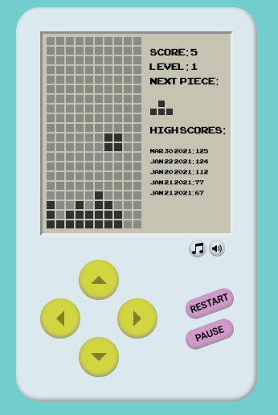
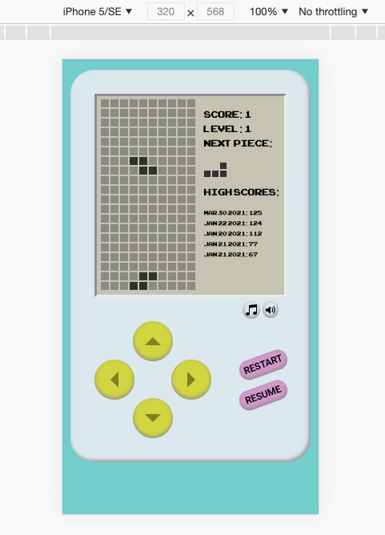

###  General Assembly, Software Engineering Immersive

# Tetris - Project 1


## Overview
For the first project of General Assembly’s Software Engineering Course, we were given a week to code a fully functioning arcade game. It was an individual project, applying what we had learnt around Javascript fundamentals. I chose Tetris. 


[Click here to play the game.](https://steftones.github.io/Tetris/)


### Project Brief
* Render a browser game
* Use JavaScript to manipulate the DOM
* Write logic displaying when a player had won
* Write the game in vanilla JavaScript
* Deploy the project using GitHub pages


### Technologies used
* HTML
* CSS
* ES6 JavaScript
* Git


## Setting the Foundations
I started out writing pseudocode for the game logic, including dealing with collision detection, gameplay and scorekeeping. I thought about the game state and created variables for the score, level, speed, whether the game was running and whether it had been paused.

I decided to use a matrix of arrays as the data structure to represent the board’s state. Each value in an array would represent whether a cell was empty, occupied or part of a moving piece. The matrix was visually translated onto the page in a series of ```<div>``` elements, forming a 10 x 20 grid for the player to see. The board would be re-rendered on every game move and cells styled according to array values.

Each Tetris piece (tetromino) was represented in its own matrix, with ```0``` and ```8``` values representing free cells and cells occupied by the piece, for example:

```
J = [[0,8,0],
       [0,8,0],
       [8,8,0]]
```

I defined an initial X Y board position that kept track of the tetromino’s location on the board. As the player moves, the board position changes, the piece is initialized at its new position in the board matrix and the board is re-rendered. I used ```setInterval``` to move the piece downwards at a certain speed, which would increase in a linear manner with level.

I added buttons and event listeners to start/pause and restart the game. I created a variable to store the state of the current moving piece, along with a ```setCurrentPiece``` function. I then thought about the way that pieces would be chosen and decided upon storing a sequence of pieces in an array. This array would be shuffled using ```.sort()``` and ```Math.random()``` on creation, and would be re-created when emptied. I decided to implement this solution rather than choosing purely random pieces so that the user would not receive the same piece twice in a row, plus it produced a convenient way to display the next piece to the user with ```drawNextPiece()```


## Player interaction
In Tetris, the player can move left, right or down, so I added event listeners to these keys, as well as keys ‘a’, ‘s’ and ‘d’ which are often used in gaming. Upon a keypress, if no collisions were detected, the X Y coordinates of the piece would be incremented/decremented accordingly. The piece would then be initialized at its new location on the board and the board would be re-drawn, for example:

```
function movementHelper(location){
  clearBoard()
  initializePiece(location)
  drawBoard()
}

function moveLeft(){
  if (checkCollision('left')) return
  const newLocation = [(point.x - 1), point.y]
  point.set(newLocation)
  movementHelper(newLocation)
}
```


## Collision detection
Collision detection worked on the basis of calculating the would-be coordinates of pieces. If these coordinates were the same as the coordinates of static pieces or boundaries, the tetromino would not move to its new location.

Controllers were also written to detect if a shape had reached the floor or if it collided with a static piece, after which it would render as a fixed piece on the board with the ```fixAllBlocks()``` function. During this time it also made sense to code “game over” detection. After a move, if the top row of the board contained set pieces, the game’s ```isRunning``` state changed to ```false```. The biggest challenge with collision detection came with piece rotation collisions.


## Piece rotation
Piece rotation was calculated by trying to rotate an individual piece in its matrix. I thought that after coming up with a way to rotate each piece, I could then superimpose the rotated piece onto the board matrix.


#### Pseudocode:
1. Transpose the matrix. Take rows and turn them into columns. Swap array[row][column] with array[column][row])
2. Flip the matrix horizontally. Reverse the order of each row.

#### Code:
```
function rotatePiece(){
 const newPiece = [[],[],[]]
 if (pieces.currentPiece.length === 4) newPiece.push([])
 for (let i = 0; i < pieces.currentPiece.length; i++){
   for (let j = 0; j < pieces.currentPiece[i].length; j++){
     newPiece[i][j] = pieces.currentPiece[j][i]
   }
   newPiece[i].reverse()
 }
 return pieces.currentPiece = newPiece
}
```

To detect rotation collisions, I took “snapshots” of an area of the board at the piece’s X Y position. The snapshot would be the area of the board where the current piece was. Similar to previous collision detection, if there were any overlaps ```checkCollision(‘rotation’)``` would return ```true```.

#### Pseudocode:
1. Create either a 3 x 3 or 4 x 4 snapshot of the board at the tetromino’s X Y location.
2. Create a snapshot of this area without the tetromino (comparison snapshot)
3. Rotate the piece
4. See if any rotated piece elements are in the same position as those in the comparison snapshot

In hindsight, as the collision detection was also manipulating the rotation of the current piece, it had to be reset in a cumbersome manner by repeating the rotate function three more times, and I felt that this code was not DRY enough. This could have been improved.


## Additional functionality
Keen to go above and beyond the brief, I created objects for playing both sound files and the Tetris theme song which was coded in JavaScript using an external library. Buttons were created to give the user control over these sounds. The score state and ```Date()``` played were set in ```localStorage```. A function was written to iterate over the stored scores, displaying an ordered list of high scores with their corresponding date.


## Challenges
* Sometimes the game does not always immediately stop when needed which can cause a pile-up of shapes at the top of the board and an illegal incrementation of the score. In hindsight, it would have been better to check if the game was over every time a new shape was spawned rather than when a piece attempted to move down.
* After completing the assignment I noticed that although pieces are able to rotate, some shapes have a slightly off-centre rotation axis.
* Personally, I feel that the game is too fast/difficult after a certain level. The game could be redesigned to stop increasing speed after a defined point.

If you have spotted any additional bugs, please let me know by <a href="mailto:stefansokolowski16@gmail.com">email</a>.


## Achievements
* Coding gaming logic and seeing the results working.
* Creating a neat looking product.
* Going above and beyond the brief.


## Key learnings
* Learnt about all the ways of manipulating the DOM.
* Discovered more about gaming logic and learnt various approaches for tackling collision detection.
* Planning all of the gaming logic in pseudocode before writing code really helped.
* Taking an object-orientated approach was useful in keeping data organised.


## Features I'd like to implement
* Scoring based on <a href="https://tetris.wiki/Scoring">Sega’s Scoring system.</a>
* Seeding pseudorandom sequences of pieces.
* A cleaner approach to controlling game cell styling by toggling ```classList``` rather than setting hard-coded styles.
* Additional styling to further enhance the “retro look” of the game.


## The finished product



